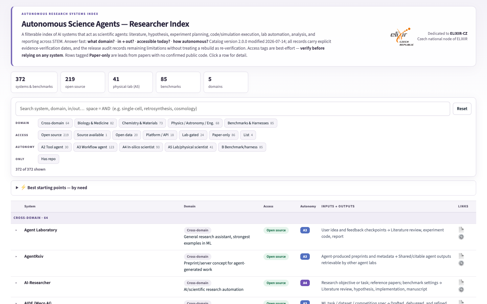

# Autonomous Science Agents

A researcher-oriented index of AI systems that act across scientific workflows: literature, hypothesis generation, experiment or simulation planning, code execution, laboratory automation, analysis, and reporting. The index also includes benchmarks and evaluation harnesses.

**[Open the interactive index](https://michalie.github.io/autonomous-stem-agents-wiki/)**

## What the index provides

- Search and filters across scientific domains, autonomy levels, access routes, and evidence status.
- Concise descriptions of inputs, outputs, workflow roles, and current availability.
- Direct links to papers, code, datasets, platforms, and official project pages.
- Stable record identifiers, provenance, evidence dates, and machine-readable distributions.

The displayed catalog is generated deterministically from [`agents_final.json`](agents_final.json). A **paper-only** label means that no currently runnable public implementation was confirmed during review; researchers should verify availability before relying on it.

## Taxonomy

Autonomy is described from **A1 assistant** through **A5 physical-laboratory scientist**, with **B** reserved for benchmarks and harnesses. Access is distinguished as open-source, open-data, platform/API, lab-gated, paper-only, or list resource. These labels support comparison; they are not claims of scientific validity or operational approval.

## Machine-readable access

- [Catalog JSON](https://michalie.github.io/autonomous-stem-agents-wiki/agents_final.json)
- [JSON Schema](https://michalie.github.io/autonomous-stem-agents-wiki/schema.json)
- [JSON-LD metadata](https://michalie.github.io/autonomous-stem-agents-wiki/metadata.jsonld)
- [Human-readable Markdown](https://michalie.github.io/autonomous-stem-agents-wiki/autonomous_stem_agents_wiki.md)

## Contribute

Suggest an agent, benchmark, or correction through the [structured issue form](https://github.com/MichaLie/autonomous-stem-agents-wiki/issues/new?template=add-agent.yml). Contributions should point to current primary or first-party sources; inclusion and autonomy classification are reviewed against the documented policy.

## Maintain or fork

This repository includes its own reproducible maintenance system:

- [`MAINTENANCE.md`](MAINTENANCE.md) is the canonical update, validation, and release protocol.
- [`AGENTS.md`](AGENTS.md) and [`CLAUDE.md`](CLAUDE.md) map coding agents to that protocol.
- [`build.py`](build.py) creates synchronized public distributions.
- [`validate_catalog.py`](validate_catalog.py) enforces schema, provenance, licence, and release checks.
- [`.github/workflows/quality.yml`](.github/workflows/quality.yml) runs the deterministic quality gate on GitHub.

Forks should replace the resource identity, creator, publisher, licence, and provenance metadata with claims they are authorized to make.

## Responsible use

Autonomous outputs are leads, not validated scientific results. Use orthogonal validation and domain review; physical-laboratory operation requires the relevant institutional safety and governance processes.

## Stewardship and licences

Curated and published by **Michaela Liegertová** ([michaela.liegertova@img.cas.cz](mailto:michaela.liegertova@img.cas.cz)), affiliated with the [Institute of Molecular Genetics of the Czech Academy of Sciences](https://www.img.cas.cz/en/). Dedicated to the [ELIXIR-CZ](https://www.elixir-czech.cz/) community.

IMG affiliation and the ELIXIR-CZ dedication provide context; they do not imply institutional publication authority or endorsement.

Catalog data, metadata, and original documentation are licensed under [CC BY 4.0](LICENSE-CONTENT.md). Maintenance and build software are licensed under the [MIT License](LICENSE-CODE). Indexed papers, software, datasets, services, logos, and trademarks retain their own terms.

See [`CHANGELOG.md`](CHANGELOG.md) for version history.
